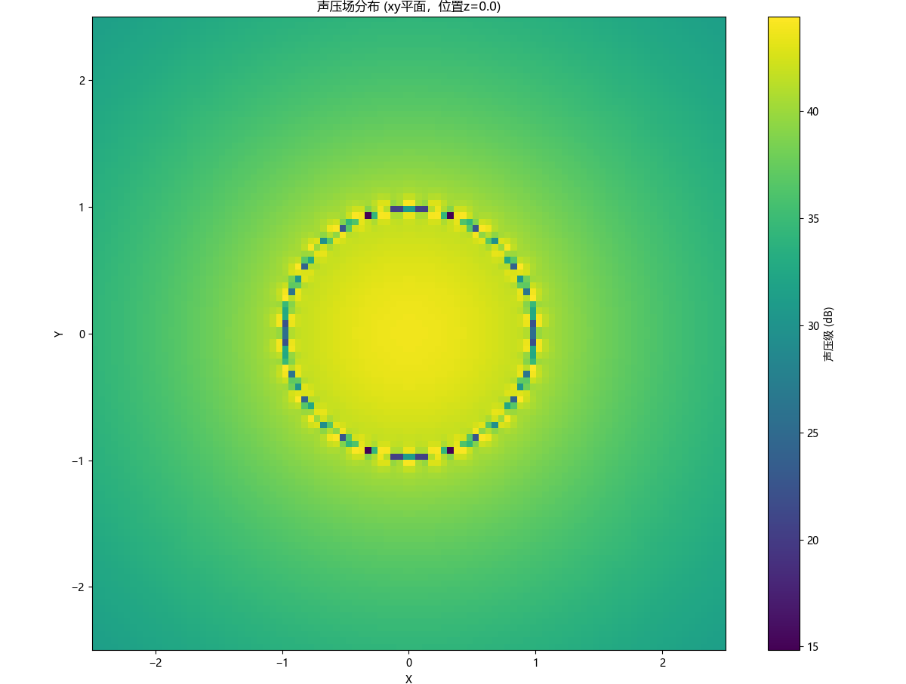

# Boundary Element Method

This is a BEM tool that takes .stl files as input and outputs the acoustic field potential (sound pressure and particle velocity) at any point in space.

## Example

### 1. Pulsating Sphere

### 2. One Vibrating Mesh 

### 3. A Pulsating Sphere and A Rigid Sphere

#### (1) ka=3

#### (2) ka=5

